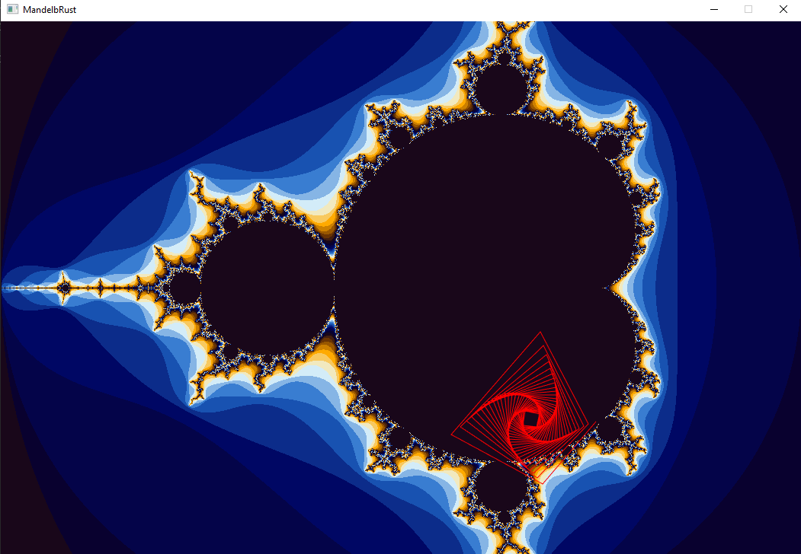

# mandelbrust

A Mandelbrot set explorer written in Rust, using `ggez` as renderer.
It draws the Mandelbrot set and a red line, which shows
the first `utils::ESCAPE_POINT` bounces of the mouse-pointed value.

**Note**: this program uses `ggez 0.5.1`, but the current latest version
is `0.6.0`, and this is due to a heavy drop in performance.

## TODO list

- [ ] zoom (probably won't be implemented)
